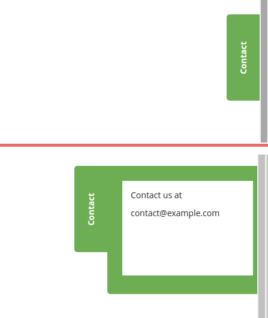

# Side slideout box for Magento 2



This module implements an information/promotion/contact me/whatever box that slides out on hover.

The content can be set using Magento CMS.

No javacscipt, pure css implementation.

## Installation

1. Copy module to [magento-root]/app/code/Gelo/Slideout

2. Enter following commands to enable module:

   ```
   php bin/magento module:enable Gelo_Slideout
   php bin/magento setup:upgrade
   php bin/magento cache:clean
   ```

3. If Magento is running in production mode, deploy static content: 

   ```
   php bin/magento setup:static-content:deploy
   ```

4. Enable and configure the extension in Magento Admin under *Stores* >
   *Configuration* > *SIDE SLIDEOUT*
   
5. Create sidebox content content block with id *slideout* (or using your own id set in configuration).


